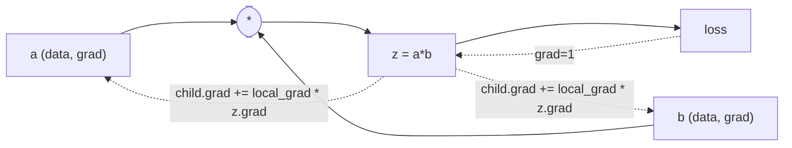
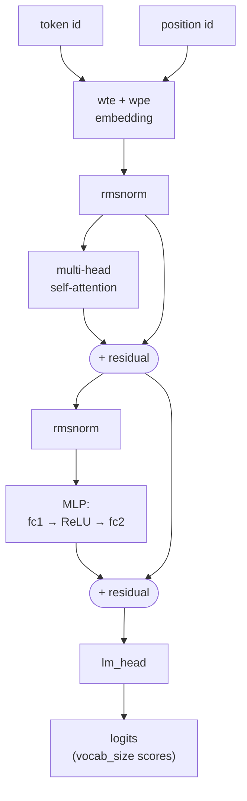
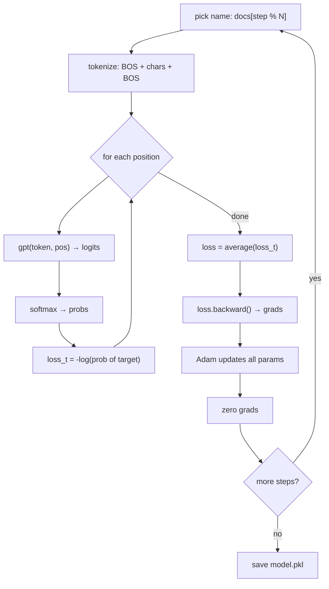
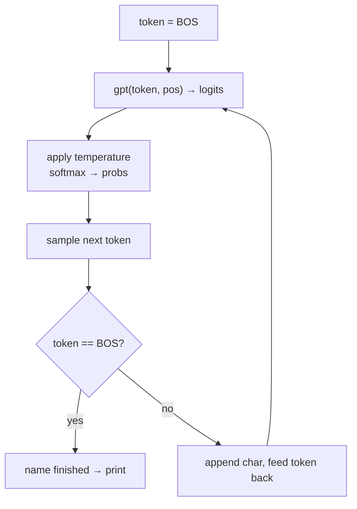
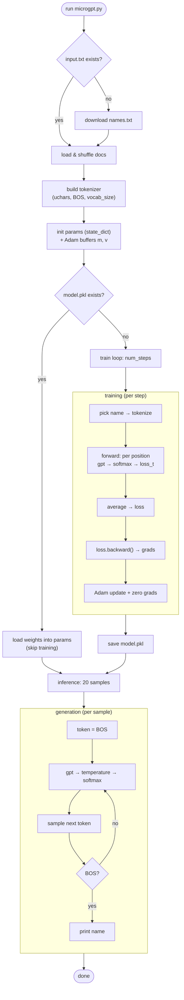

# microGPT — Detailed Code Explanation

> A complete GPT (transformer language model) written in **pure, dependency-free Python**.
> It trains a tiny character-level model on a list of names, then generates brand-new,
> made-up names one character at a time.
>
> Source: Andrej Karpathy's [`microgpt.py`](https://gist.github.com/karpathy/8627fe009c40f57531cb18360106ce95).

---

## High-level purpose

microGPT teaches a small neural network a single skill: **predict the next character** in a
name. After training on ~32,000 real names, the model can *hallucinate* new plausible-sounding
names by sampling one character at a time until it decides the name is complete.

The whole thing is deliberately "atomic" — every piece of a real GPT is present, but written
from scratch with no libraries (no NumPy, no PyTorch):

- **Autograd** — a scalar automatic-differentiation engine (the `Value` class) that builds a
  computation graph and back-propagates gradients via the chain rule.
- **Transformer model** — token + positional embeddings, multi-head self-attention, an MLP,
  RMSNorm, and residual connections (GPT-2 style, with minor simplifications).
- **Training loop** — cross-entropy loss, backprop, and the Adam optimizer with learning-rate decay.
- **Inference** — autoregressive sampling with a temperature control.
- **Persistence** — the trained weights are saved to `model.pkl` so later runs skip training.

The guiding idea (from the file's docstring): *"This file is the complete algorithm.
Everything else is just efficiency."* Real frameworks do the exact same math — just faster and
on vectors/GPUs instead of one Python scalar at a time.

---

## Input

The model's only external input is a **text file of names**, one per line.

| Item | Detail |
|------|--------|
| Data file | `input.txt` in the current working directory |
| Source | Downloaded automatically from Karpathy's `makemore` repo if `input.txt` is missing |
| Contents | ~32,033 lowercase names, e.g. `emma`, `olivia`, `ava`, `isabella` |
| Loaded as | `docs` — a Python `list[str]`, one string per name |

What happens to the input at startup:

1. **Ensure the file exists** — if `input.txt` is absent, download `names.txt` via `urllib`.
2. **Read & clean** — strip whitespace and drop blank lines: `docs = [line.strip() for line in open('input.txt') if line.strip()]`.
3. **Shuffle** — `random.shuffle(docs)` (seeded, so it's reproducible).
4. **Build the vocabulary (tokenizer)** from the characters actually present:
   - `uchars` — the sorted unique characters → each gets an integer id `0..n-1`.
   - `BOS` — one extra special "Beginning/End Of Sequence" token id (`= len(uchars)`).
   - `vocab_size` — total number of distinct tokens (`len(uchars) + 1`).

For this names dataset the vocabulary is **27 tokens**: 26 lowercase letters `a–z` plus the
single `BOS` marker.

There is no interactive input — hyperparameters like `num_steps`, `temperature`, `n_layer`,
`n_embd`, etc. are hardcoded constants near the top of the file.

---

## Output

The program produces two kinds of output: **console text** and a **saved model file**.

### 1. Console output

At startup (always):

```text
num docs: 32033
vocab size: 27
num params: 4192
```

Then one of two paths:

- **First run (trains):** a live-updating progress line, then a save confirmation:
  ```text
  step 1000 / 1000 | loss 2.6497
  saved trained model to model.pkl
  ```
- **Later runs (loads):** training is skipped entirely:
  ```text
  loaded trained model from disk, skipping training
  ```

Finally, inference prints **20 newly hallucinated names**:

```text
--- inference (new, hallucinated names) ---
sample  1: kamon
sample  2: ann
sample  3: karai
...
sample 20: anton
```

### 2. File output

| File | When | Contents |
|------|------|----------|
| `input.txt` | If missing | The downloaded names dataset |
| `model.pkl` | After training | The trained weights — a pickled `list[float]` of all 4192 parameter values |

The model file makes training a **one-time cost**: the first run trains and writes `model.pkl`;
every subsequent run loads it in milliseconds and jumps straight to generating names. To force a
fresh retrain, delete `model.pkl`.

---

## Building blocks

The code is built from five conceptual pieces.

### 1. Tokenizer — characters ↔ integers

Neural networks work on numbers, not text, so every character is mapped to an integer id.

- `uchars = sorted(set(''.join(docs)))` — the unique characters become ids `0..n-1`.
- `BOS = len(uchars)` — a special token marking the start **and** end of a name.
- Encode: `uchars.index(ch)` (char → id). Decode: `uchars[id]` (id → char).

A name like `ava` becomes `[BOS, id('a'), id('v'), id('a'), BOS]`.

### 2. `Value` — the autograd engine

This is the heart of the file. Each `Value` wraps **one scalar number** and remembers how it was
computed, so gradients can flow backward through it.

Each node stores four things:

| Field | Meaning |
|-------|---------|
| `data` | the scalar value from the forward pass |
| `grad` | ∂loss/∂(this node), filled during the backward pass |
| `_children` | the input nodes it was built from |
| `_local_grads` | the local derivative w.r.t. each child |

**Forward pass:** every operator (`+`, `*`, `**`, `log`, `exp`, `relu`, …) returns a new `Value`
that both computes the result *and* records its children and local derivatives. For example,
`a * b` stores local grads `(b.data, a.data)` because ∂(a·b)/∂a = b and ∂(a·b)/∂b = a.

**Backward pass (`backward()`):** does a **topological sort** of the whole graph, seeds the output
with `grad = 1`, then walks the nodes in reverse applying the chain rule:
`child.grad += local_grad * v.grad`. This is exactly reverse-mode automatic differentiation — the
same principle as PyTorch's `autograd`, just one scalar at a time.



### 3. Parameters — the model's knowledge (`state_dict`)

All learnable weights are `Value` objects, randomly initialized (`random.gauss(0, 0.08)`), grouped
in a `state_dict`:

| Weight | Shape | Role |
|--------|-------|------|
| `wte` | `vocab_size × n_embd` | token embedding table |
| `wpe` | `block_size × n_embd` | positional embedding table |
| `attn_wq/wk/wv/wo` | `n_embd × n_embd` | attention projections (per layer) |
| `mlp_fc1` | `4·n_embd × n_embd` | MLP expand (per layer) |
| `mlp_fc2` | `n_embd × 4·n_embd` | MLP contract (per layer) |
| `lm_head` | `vocab_size × n_embd` | final projection to next-token scores |

All weights are flattened into a single list `params` (**4192** values for the default config) so
the optimizer can iterate over them uniformly.

### 4. The `gpt()` function — the model forward pass

Maps **one token + its position** → **logits** (raw scores over the next character). It follows
the GPT-2 architecture with small simplifications (RMSNorm instead of LayerNorm, no biases, ReLU
instead of GeLU):

1. **Embed:** look up token embedding + positional embedding and add them.
2. **Per layer:**
   - **Attention block:** compute query/key/value; cache k,v; for each of `n_head` heads do
     scaled dot-product attention over all previous positions (`softmax(q·k / √head_dim)`), then
     mix with a residual connection.
   - **MLP block:** RMSNorm → expand → ReLU → contract → residual.
3. **Project:** `lm_head` turns the final vector into `vocab_size` logits.

Helper functions: `linear` (matrix-vector multiply), `softmax` (scores → probabilities),
`rmsnorm` (normalization for stable training).



### 5. Optimizer — Adam + learning-rate decay

After gradients are computed, **Adam** updates every parameter. It keeps two running buffers per
parameter — `m` (first moment, the smoothed gradient) and `v` (second moment, the smoothed squared
gradient) — applies bias correction, and steps each weight by
`p.data -= lr_t * m_hat / (sqrt(v_hat) + eps)`. The learning rate `lr_t` decays linearly to zero
over training, so updates get gentler as the model converges.

---

## Main flow

The script runs top-to-bottom in three phases: **setup → train-or-load → inference**.

### Phase A — Setup (always runs)

Load the dataset, build the tokenizer, initialize the parameters, and allocate the Adam buffers
`m` and `v`. Prints `num docs`, `vocab size`, and `num params`.

### Phase B — Train **or** load

A single guard decides the path:

```python
if os.path.exists('model.pkl'):
    # load weights, skip training
else:
    # train, then save weights
```

**Training loop** (runs only when no saved model exists) — one **document (name) per step**, for
`num_steps` (1000) steps:

1. **Pick a name:** `doc = docs[step % len(docs)]`.
2. **Tokenize:** wrap with BOS on both ends → `[BOS, ...chars..., BOS]`.
3. **Forward over positions:** for each position, run `gpt()` → logits → `softmax` → probabilities,
   and the loss at that position is `-log(prob of the correct next character)` (cross-entropy).
4. **Average the per-position losses** into one final `loss` node that ties the whole graph together.
5. **Backward:** `loss.backward()` fills `grad` for every parameter.
6. **Adam update:** decay the learning rate, update every parameter, then zero its gradient.
7. Print the running `step / loss` line.

After the loop, save `[p.data for p in params]` to `model.pkl`.



### Phase C — Inference (always runs)

Generate **20 new names**. For each sample, start from `BOS` and generate characters
autoregressively until the model emits `BOS` again (end of name) or hits `block_size`:

1. Run `gpt()` on the current token → logits.
2. Apply **temperature** (`logits / temperature`) then `softmax` → probabilities.
3. **Sample** the next token randomly, weighted by those probabilities (`random.choices`).
4. If it's `BOS`, stop; otherwise append the decoded character and feed it back in.

Because each new token is fed back as the next input, the model builds the name one character at a
time — this feedback is what "autoregressive" means.



---

## Full flowchart

The whole program end-to-end:



### Loop summary

| Loop | Iterates over | Purpose |
|------|---------------|---------|
| Training steps | `num_steps` (1000) | one name processed per step |
| Positions (train) | characters in the name | build the loss over each next-char prediction |
| Params (Adam) | all 4192 `params` | apply the gradient update |
| Samples (inference) | 20 | generate 20 names |
| Positions (inference) | up to `block_size` (16) | emit one character at a time until BOS |

### In one sentence

microGPT forwards names through a scalar-autograd GPT to compute a next-character prediction loss,
back-propagates to get gradients, updates the weights with Adam over 1000 steps, saves the result
to `model.pkl`, and finally samples 20 brand-new names one character at a time.

---

## Glossary — technical terms in plain English

| Term | Plain-English meaning |
|------|-----------------------|
| **GPT** | "Generative Pre-trained Transformer" — a neural network that generates text by repeatedly predicting the next token. |
| **Transformer** | The neural-network design behind modern language models; its key trick is *attention*, letting each position look at earlier positions. |
| **Token** | The smallest unit the model reads/writes. Here one token = one character (plus the special `BOS`). |
| **Tokenizer** | The translator between text and token ids (numbers). |
| **BOS** | "Beginning Of Sequence" — a special marker token used to signal the start and end of a name. |
| **Vocabulary / `vocab_size`** | The full set of distinct tokens the model knows (27 here: `a–z` + `BOS`). |
| **Embedding** | A learned list of numbers (a *vector*) that represents a token or position, so the network can do math on it. |
| **Token embedding (`wte`)** | The vector that stands for *which character* it is. |
| **Positional embedding (`wpe`)** | The vector that stands for *where in the name* the character sits (1st, 2nd, …). |
| **Vector** | Just an ordered list of numbers (e.g. 16 numbers = a 16-dimensional vector). |
| **Parameter / weight** | One adjustable number inside the model; training tweaks these. There are 4192 of them. |
| **`n_embd` (embedding dim / width)** | How many numbers are in each vector (16). Bigger = more capacity. |
| **`n_layer` (depth)** | How many stacked transformer blocks (1 here). |
| **`n_head` (heads)** | How many parallel attention "viewpoints" run at once (4). |
| **`block_size` (context length)** | The maximum number of past tokens the model can attend to (16). |
| **Logits** | The raw, unnormalized scores the model outputs for each possible next token, before turning them into probabilities. |
| **Attention** | A mechanism where each position produces a *query* and compares it against *keys* from earlier positions to decide how much of each position's *value* to pull in. |
| **Query / Key / Value (q/k/v)** | Three vectors derived from each token: query = "what am I looking for", key = "what do I offer", value = "the information I carry". |
| **KV cache** | Saved keys and values from earlier positions, reused so they don't have to be recomputed. |
| **MLP (feed-forward)** | A small two-layer network applied to each position independently, adding extra processing power. |
| **Residual connection** | Adding a block's input back to its output (`x + block(x)`), which helps gradients flow and stabilizes training. |
| **Normalization / RMSNorm** | Rescaling a vector to a stable size so training doesn't blow up or stall. |
| **ReLU** | An activation function: keeps positive numbers, replaces negatives with 0 (`max(0, x)`). Adds non-linearity. |
| **Softmax** | Turns a list of scores into probabilities that are all positive and sum to 1. |
| **Loss** | A single number measuring how wrong the model is; training tries to make it small. |
| **Cross-entropy loss** | The specific loss for classification: penalizes assigning low probability to the correct next token. |
| **Autograd** | "Automatic differentiation" — machinery that computes gradients automatically by tracking every operation. |
| **Computation graph** | The record of every operation and its inputs, built during the forward pass and walked backward for gradients. |
| **Gradient** | The slope of the loss with respect to a parameter: which direction, and how strongly, to nudge it to reduce the loss. |
| **Forward pass** | Running data through the model to compute outputs (and the loss). |
| **Backward pass / backpropagation** | Walking the graph in reverse to compute every gradient via the chain rule. |
| **Chain rule** | The calculus rule for differentiating nested functions; the mathematical basis of backprop. |
| **Topological sort** | Ordering the graph nodes so each node comes after its inputs — needed to backprop in the right order. |
| **Optimizer** | The rule that uses gradients to update parameters. Here it's **Adam**. |
| **Adam** | A popular optimizer that adapts each parameter's step size using running averages of past gradients. |
| **Moment (`m`, `v`)** | Adam's running averages: `m` of the gradient, `v` of the squared gradient. |
| **Learning rate** | How big each update step is. |
| **Learning-rate decay** | Shrinking the learning rate over time so late training is gentler. |
| **Epoch / step** | One training iteration. Here, one step = one name. |
| **Inference** | Using the trained model to generate output (as opposed to training it). |
| **Autoregressive** | Generating one token at a time, feeding each new token back in as input for the next. |
| **Temperature** | A knob that flattens (high) or sharpens (low) the probability distribution to control randomness/creativity. |
| **Sampling** | Randomly picking the next token according to its probability (rather than always taking the most likely). |

---

## Math formulas explained

Every formula in the code, written out and explained. Notation: $x_i$ is the $i$-th element of a
vector $x$; $d$ is a dimension size; sums $\sum$ run over the stated index.

### 1. Linear layer (`linear`)

$$ y_o = \sum_{i} W_{o,i}\, x_i $$

Each output number $y_o$ is a weighted sum of all inputs $x_i$ using row $o$ of the weight matrix
$W$. This is a plain matrix-vector multiply — the fundamental operation of a neural net. *In code:*
`sum(wi * xi for wi, xi in zip(wo, x))`.

### 2. Softmax (`softmax`)

$$ \text{softmax}(z)_i = \frac{e^{z_i - \max(z)}}{\sum_j e^{z_j - \max(z)}} $$

Turns raw scores $z$ into probabilities: exponentiate each score, then divide by the total so they
sum to 1. Subtracting $\max(z)$ changes nothing mathematically but keeps $e^{(\cdot)}$ from
overflowing — this is the "numerical stability" trick. *In code:* the `max_val` subtraction plus
`exp` and normalize.

### 3. RMSNorm (`rmsnorm`)

$$ \text{RMSNorm}(x)_i = \frac{x_i}{\sqrt{\dfrac{1}{d}\sum_{j} x_j^2 + \varepsilon}} $$

Divide every element by the vector's *root-mean-square* magnitude, so the vector has a consistent
scale regardless of how large its raw values are. The tiny $\varepsilon = 10^{-5}$ prevents
division by zero. This keeps activations stable so training doesn't diverge. *In code:*
`ms = sum(xi*xi)/len(x)`, `scale = (ms + 1e-5) ** -0.5`.

### 4. ReLU activation (`relu`)

$$ \text{ReLU}(x) = \max(0, x) $$

Keeps positive values, zeroes out negatives. This non-linearity is what lets stacked layers learn
non-trivial functions. Its derivative (used in backprop) is 1 for $x>0$ and 0 otherwise.

### 5. Scaled dot-product attention (inside `gpt`)

Attention score between the current query and a past key:

$$ a_t = \frac{\sum_{j} q_j\, k_{t,j}}{\sqrt{d_{\text{head}}}} $$

$$ w = \text{softmax}(a), \qquad \text{out}_j = \sum_{t} w_t\, v_{t,j} $$

The query $q$ is compared to each earlier position's key $k_t$ via a dot product (a similarity
measure). Dividing by $\sqrt{d_{\text{head}}}$ keeps the scores from growing too large as the head
dimension grows. Softmax turns the scores into weights $w$, and the output is the weighted average
of the value vectors $v_t$ — i.e. the model "attends" more to relevant earlier characters. *In
code:* `attn_logits`, `attn_weights`, and `head_out`.

### 6. Residual connection

$$ x \leftarrow x + \text{block}(x) $$

Add each block's input back to its output. This gives gradients a direct path backward and makes
deep networks trainable. *In code:* `x = [a + b for a, b in zip(x, x_residual)]`.

### 7. Cross-entropy loss (training objective)

Per position, with $p$ the predicted probabilities and $t$ the correct next token:

$$ \ell_t = -\log\big(p_{t}\big) $$

Averaged over the $n$ positions of the name:

$$ \mathcal{L} = \frac{1}{n} \sum_{t=1}^{n} \ell_t $$

If the model gives the correct next character a high probability, $-\log(p)$ is small; if it gives
it a low probability, the penalty is large. Minimizing this pushes the model to predict real names
well. *In code:* `loss_t = -probs[target_id].log()` then `loss = (1/n) * sum(losses)`.

### 8. Chain rule (backpropagation, `Value.backward`)

For a node $v$ built from children $c$ with local derivatives $\frac{\partial v}{\partial c}$:

$$ \frac{\partial \mathcal{L}}{\partial c} \mathrel{+}= \frac{\partial v}{\partial c} \cdot \frac{\partial \mathcal{L}}{\partial v} $$

Read as: "the child's gradient accumulates the local derivative times the parent's gradient." The
output seeds $\frac{\partial \mathcal{L}}{\partial \mathcal{L}} = 1$, and this rule propagates
gradients to every parameter. The `+=` matters because a value used in several places sums the
contributions from all of them. *In code:* `child.grad += local_grad * v.grad`.

Local derivatives recorded by each operation:

| Operation | Value | Local derivative(s) |
|-----------|-------|---------------------|
| $a + b$ | $a+b$ | $1,\ 1$ |
| $a \cdot b$ | $ab$ | $b,\ a$ |
| $a^{k}$ | $a^{k}$ | $k\,a^{k-1}$ |
| $\log a$ | $\ln a$ | $1/a$ |
| $e^{a}$ | $e^{a}$ | $e^{a}$ |
| $\text{ReLU}(a)$ | $\max(0,a)$ | $1$ if $a>0$ else $0$ |

### 9. Adam optimizer update

Running averages of the gradient $g$ (first moment $m$) and squared gradient (second moment $v$):

$$ m \leftarrow \beta_1 m + (1-\beta_1)\, g, \qquad v \leftarrow \beta_2 v + (1-\beta_2)\, g^2 $$

Bias correction (because $m,v$ start at 0, they're too small early on), at step $s$:

$$ \hat{m} = \frac{m}{1 - \beta_1^{\,s}}, \qquad \hat{v} = \frac{v}{1 - \beta_2^{\,s}} $$

Parameter update:

$$ \theta \leftarrow \theta - \eta_s \cdot \frac{\hat{m}}{\sqrt{\hat{v}} + \epsilon} $$

Each parameter $\theta$ moves opposite its gradient, but the step is scaled by
$1/\sqrt{\hat{v}}$ so parameters with consistently large gradients take smaller, steadier steps.
$\epsilon = 10^{-8}$ avoids division by zero. *In code:* the `m[i]`, `v[i]`, `m_hat`, `v_hat`,
and `p.data -= ...` lines.

### 10. Linear learning-rate decay

$$ \eta_s = \eta_0 \left(1 - \frac{s}{\text{num\_steps}}\right) $$

The learning rate starts at $\eta_0 = 0.01$ and shrinks linearly to 0 by the final step, so updates
get gentler as training converges. *In code:* `lr_t = learning_rate * (1 - step / num_steps)`.

### 11. Temperature scaling (inference)

$$ p = \text{softmax}\!\left(\frac{\text{logits}}{T}\right) $$

Dividing the logits by temperature $T$ before softmax controls randomness: $T < 1$ sharpens the
distribution (safer, more repetitive names), $T \to 1$ keeps it as-is (more diverse). Here
$T = 0.5$. *In code:* `softmax([l / temperature for l in logits])`.

### 12. Weight initialization

$$ W_{o,i} \sim \mathcal{N}(0,\ 0.08^2) $$

Every weight starts as a small random number drawn from a Gaussian (normal) distribution with mean
0 and standard deviation 0.08. Small random values break symmetry so different neurons learn
different things, without starting so large that training destabilizes. *In code:*
`Value(random.gauss(0, std))`.
